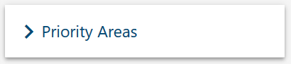

**Hot Spotting** provides data visualisation and mapping tools that enables staff to quickly understand the population health characteristics of the PHNs catchment.

For an introduction please see this video:  
[https://www.youtube.com/watch?v=Cd9cfggO4zE](https://www.youtube.com/watch?v=Cd9cfggO4zE) (2min 29 secs)

## Structure

The **Hot Spotting** data is composed of 4 seperate parts to represent all  required information.

- **Priority Area**  
  The area of focus, for example: Mental Heath
- **Subject**  
  A subcategory, for example: Indicators
- **Measure**  
  An individual dataset, for example: Registered mental heath clients
- **Entry**  
  A number for a given LGA representing a count of the given **Measure**.

## How to create a **Priority Area**

1. <a href="../../../members/#sign-in-to-the-phn-exchange" target="_blank">Sign In</a> to your **PHN Admin** account.
2. Click **PHN Admin** on the left navigation menu.
3. Select your PHN by clicking `CONTINUE`.
4. On the **PHN Admin** page, scoll down to the section named **Priority Areas** and expand the section by clicking on it.  
      
5. In the bottom right of the **Priority Areas** section, click the `CREATE` button.
6. In the **Create Priority Area** popup window, enter a priority area name and click `CREATE`
7. Success! you have finished **How to create a Priority Area**

## How to create a **Subject**

1. <a href="../../../members/#sign-in-to-the-phn-exchange" target="_blank">Sign In</a> to your **PHN Admin** account.
2. Click **Priority Areas** on the left navigation menu.
3. Click the switch named `Enable Editing` to toggle it to the Yes position.
4. Click `CREATE SUBJECT` and enter a Subject name in the popup window.
6. In the **Create Subject** popup window, enter a subject name and click `CREATE`
6. Success! you have finished **How to create a Subject**

## How to create a **Measure**

1. <a href="../../../members/#sign-in-to-the-phn-exchange" target="_blank">Sign In</a> to your **PHN Admin** account.
2. Click **Priority Areas** on the left navigation menu.
3. Click the switch named `Enable Editing` to toggle it to the Yes position.
4. Click `CREATE MEASURE` and enter a Subject name in the popup window.
6. In the **Create Measure** popup window, enter a measure name, source and bias then click `CREATE`
7. Success! you have finished **How to create a Measure**

## How to enter an **Entry**

1. <a href="../../../members/#sign-in-to-the-phn-exchange" target="_blank">Sign In</a> to your **PHN Admin** account.
2. Click **Priority Areas** on the left navigation menu.
3. Click the switch named `Enable Editing` to toggle it to the Yes position.
4. The individual fields of each LGA for a **Measure** measure can be given an **Entry**
  
5. Success! you have finished **How to enter an Entry**