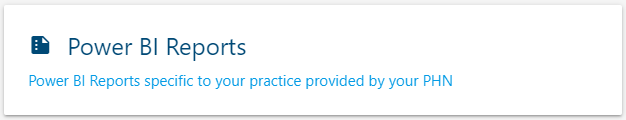

## How to access the **Power BI Reports**

1. Start by follow the guide: <a href="../../practices/introduction/#how-to-access-the-gp-hub" target="_blank">How to access the GP Hub</a>.
2. Once you have reached the **GP Hub** click the `Power BI Reports` button.
      
3. Success! You have reached the **Power BI Reports**.