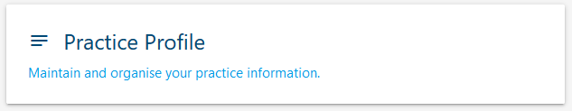

To assist quality improvment, GP and PHN staff can maintain the Practice Profile to have a source of truth about a practices details.

*NOTE: If your practice is using a data extraction vendor like PenCS or Polar, some of the details within the Practice Profile may already be entered.*

## How to update a **Practice Profile**

1. Start by following the guide: <a href="../../practices/introduction/#how-to-access-the-gp-hub" target="_blank">How to access the GP Hub</a>.
2. Once you have reached the **GP Hub** click the `Practice Profile` button.
    
3. Enter your General practice information into the form.
4. At the bottom of the page click `SAVE`.
5. Success! You have updated a **Practice Profile**.
